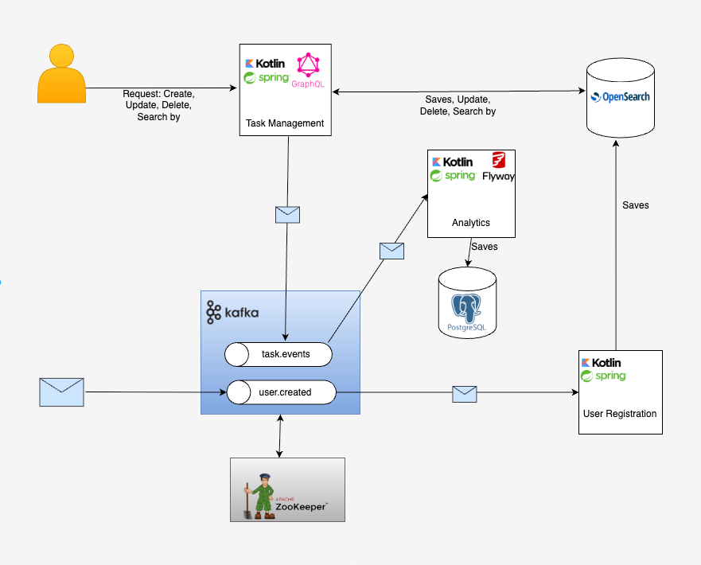

# task-management-onboarding

## Overview

This project is a task management and user onboarding system built using Kotlin, Spring, and GraphQL. It follows an event-driven microservices architecture using Apache Kafka and leverages PostgreSQL and OpenSearch for data persistence and search capabilities.

Each microservice is built following the **Hexagonal Architecture (Ports and Adapters)** pattern, ensuring a clean separation between core business logic and external systems like databases, message brokers, and APIs.

## Architecture

The diagram below illustrates the architecture of the system, showing how different components interact with each other:

### Components

- **Task Management**  
  Handles task creation, updates, deletions, and search operations (task ID, label or creation date) with partial text search capabilities via a GraphQL API.  
  Follows Hexagonal Architecture to isolate the business logic from GraphQL, Kafka, and OpenSearch adapters.

- **User Registration**  
  Use the events at `user.created` to store user data in OpenSearch.
  Also follows Hexagonal Architecture for maintainability and testability.

- **Analytics**  
  Consumes Kafka events `task.events` and stores analytical data in PostgreSQL (Task is: CREATED, COMPLETED, DELETED).
  Built using Hexagonal Architecture to keep processing logic independent of Kafka and database interactions.

- **Kafka**  
  Used as the messaging layer between services (`task.events`, `user.created`).

- **PostgreSQL**  
  Stores analytical data.

- **OpenSearch**  
  Stores task and user data.

### Data Flow

#### Users:
1. An event `user.created` is emitted when a user registers.
2. The **User Registration** service consumes this event and stores user data in **OpenSearch**.

#### Tasks:
1. A user interacts with the **Task Management** service via GraphQL.
2. The service emits events to the Kafka topic `task.events`.
3. The **Analytics** service consumes these events and stores analytical data in PostgreSQL.
4. The **Task Management** service also stores and updates data in **OpenSearch**.

## Technologies Used

- **Kotlin**
- **Spring Boot**
- **GraphQL**
- **Apache Kafka**
- **PostgreSQL**
- **OpenSearch**
- **Hexagonal Architecture (Ports and Adapters)**
- **Docker** and **Docker Compose**
- **Flyway** for database migrations (PostgreSQL)

## Getting Started

Everything is set up using Docker and Docker Compose. To run the project locally, follow these steps:

1. Ensure you have Docker and Docker Compose installed.
2. Clone the repository.
3. Build and start the services using Docker Compose (in the root directory)
4. If is the first time you run the project, you need to create a user sending a message to the `user.created` topic.
5. Save your user ID, as you will need it to interact with the Task Management service via GraphQL.